---
hide:
  - toc
---


```
                     _    _            _     _____                       _____            
                    | |  | |          | |   / ____|                     / ____|           
                    | |__| | __ _  ___| | _| (___  _ __   __ _  ___ ___| |     ___  _ __  
                    |  __  |/ _` |/ __| |/ /\___ \| '_ \ / _` |/ __/ _ \ |    / _ \| '_ \ 
                    | |  | | (_| | (__|   < ____) | |_) | (_| | (_|  __/ |___| (_) | | | |
                    |_|  |_|\__,_|\___|_|\_\_____/| .__/ \__,_|\___\___|\_____\___/|_| |_|
                                                | |                                     
                                                |_|                                     
```

```
docker run --net=openc3-cosmos-network --name HackSpaceCon -p1234:1234/udp -p1337:1337 --rm hackethos/hsc-1
```
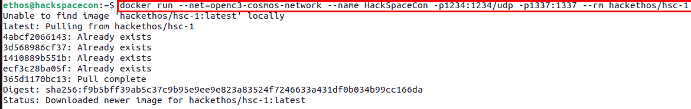


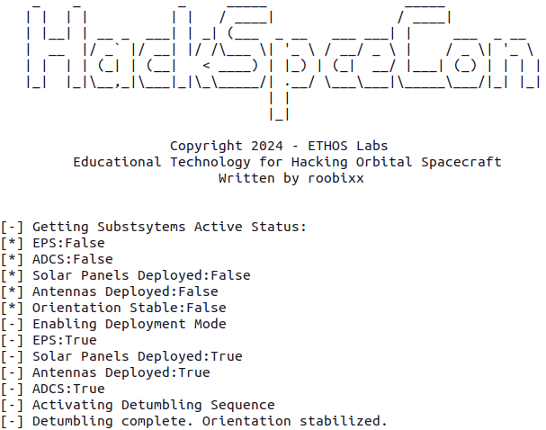

In a new terminal window, you can then run the following command to download the pre-generated COMSOS plugin:

```wget https://byos.ethoslabs.space/openc3-cosmos-hackspacecon-1-1.0.0.gem```

OR you click the following link from within your **VM**'s browser:

Click Here: [Download HSC-1 Plugin](openc3-cosmos-hackspacecon-1-1.0.0.gem)


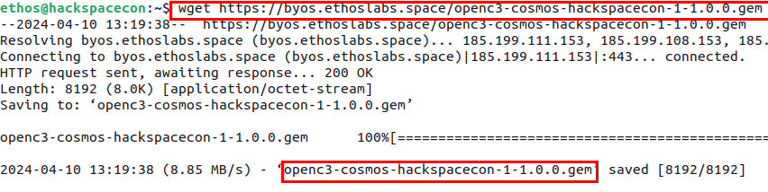

```docker network inspect openc3-cosmos-network```

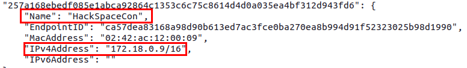


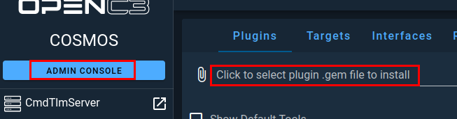


click select

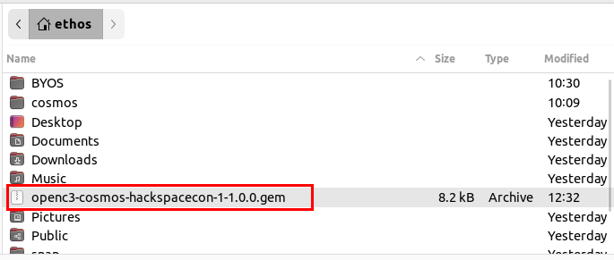

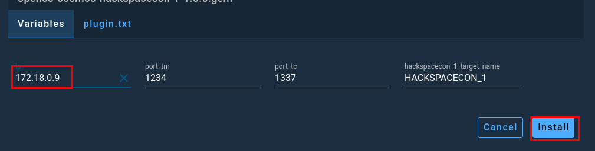

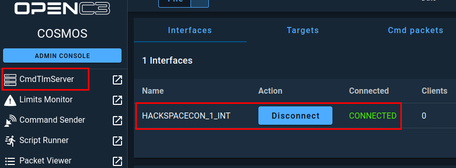

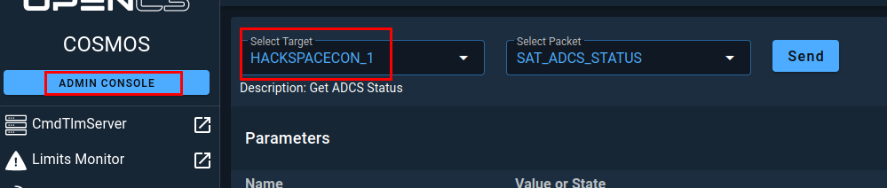

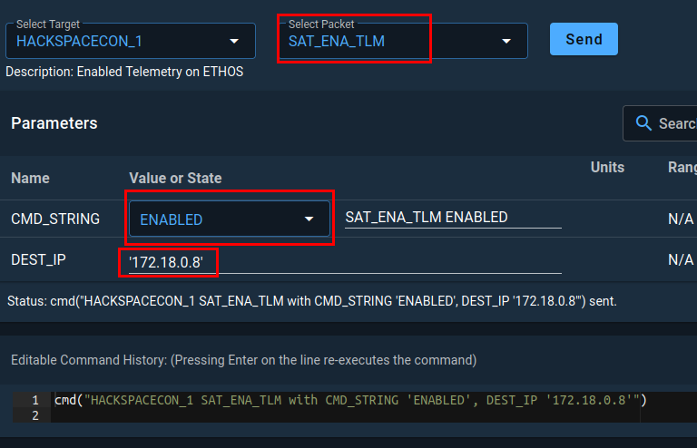

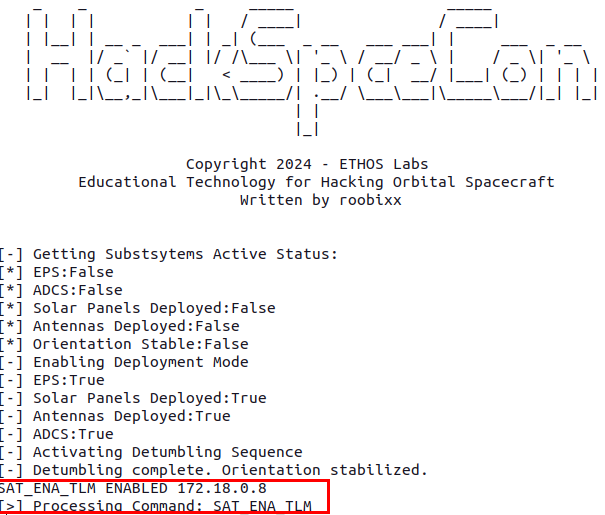

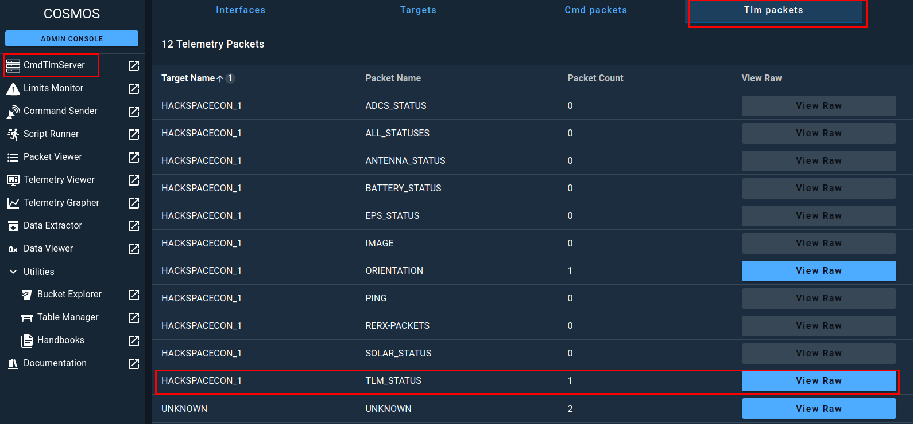