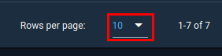

---
hide:
  - toc
---

<h1 style="text-align: center;">Bring Your Own Satellite</h1>

In this last section of the workshop, you will learn how you can deploy a pre-built satellite with a few more bells and whistles.

---
Once again, you will use Docker to deploy your virtual satellite but this time, you do not have to build it from scratch. Rather, you will simply need to deploy the new satellite using the following command:

```
docker run --net=openc3-cosmos-network --name HackSpaceCon -p1234:1234/udp -p1337:1337 --rm hackethos/hsc-1
```
<figure markdown>

  <figcaption>Deploying Docker Container</figcaption>
</figure>


The previous command will download the container image and then deploy it with the name ```HackSpaceCon```.

Right after Docker has downloaded the container image, you should see the new satellite running in your terminal window like what is shown below.

<figure markdown>

  <figcaption>HackSpaceCon Satellite Running</figcaption>
</figure>

With your ```HackSpaceCon``` satellite running, you will then need to download the pre-generated COSMOS plugin.

In a new terminal window, you can then run the following command to download the pre-generated COMSOS plugin:

```wget https://byos.ethoslabs.space/openc3-cosmos-hackspacecon-1-1.0.0.gem```

OR you click the following link from within your **VM**'s browser:

Click Here: [Download HSC-1 Plugin](openc3-cosmos-hackspacecon-1-1.0.0.gem)

<figure markdown>

  <figcaption>Downloading Plugin File Via wget</figcaption>
</figure>

After you have downloaded the plugin file, you need to get the IP address of your container using the following command, looking for the entry for ```HackSpaceCon``` as well as the ```openc3-operator``` container:

```docker network inspect openc3-cosmos-network```

<figure markdown>

  <figcaption>HackSpaceCon Container IP Address</figcaption>
</figure>

Once you have the IP address, you can switch over to your VM's browser and access the ```Admin Console``` within COSMOS, to be able to install the plugin.

<figure markdown>

  <figcaption>COSMOS Admin Console</figcaption>
</figure>

Click on the middle section as highlighted above and then find your newly downloaded plugin and click ```Select```.

<figure markdown>

  <figcaption>HackSpaceCon Plugin File Selection</figcaption>
</figure>

Like the previous section you will need to populate the IP address field for you plugin and then click ```Install```.

<figure markdown>

  <figcaption>Configuring Plugin and Installing</figcaption>
</figure>

Once installation and configuration is complete, you can click on the ```CmdTlmServer``` menu option from the side menu and see that your new interface is connected.

<figure markdown>

  <figcaption>HackSpaceCon_1 Interface Connected in COSMOS</figcaption>
</figure>

Next click on the ```Command Sender``` option and make sure ```HackSpaceCon-1``` is selected as the target. Then select ```SAT_ENA_TLM``` as the packet and in the ```DEST_IP``` field, insert the IP address of your ```openc3-operator``` container and then click ```Send```.

<figure markdown>

  <figcaption>Sending SAT_ENA_TLM Command</figcaption>
</figure>

Switching over to your terminal window where your ```HackSpaceCon-``` satellite is running, you should see that the satellite received the command successfully.

<figure markdown>

  <figcaption>Satellite Received Command</figcaption>
</figure>

Switching back to COSMOS and clicking on the ```CmdTlmSever``` menu option and the ```Tlm packets``` option in the top bar, you should see that the packet ```TLM_STATUS``` has a packet count of one, meaning that it successfully received data from your satellite. 

!!! Note
    You may need to expand the number of packets shown from the default 10 to a high number to see the packet.
    <figure markdown>
    
       <figcaption>Rows Per Page Selection</figcaption>
    </figure>
   
<figure markdown>

  <figcaption>Tlm Packets for HACKSPACECON_1</figcaption>
</figure>

Feel free to play with the other commands for a moment. Once done, you can remove the plugin from COSMOS using the ```Admin Console``` by clicking on the trashcan icon and then you can stop your virtual satellite by hitting ```crtl+c```.
