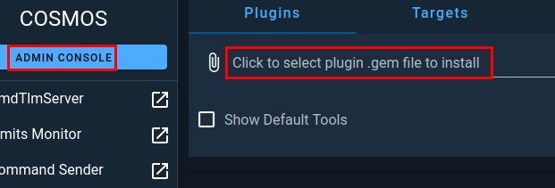
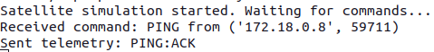

---
hide:
  - toc
---

<h1 style="text-align: center;">Build Your Own Satellite</h1>

In this portion of the workshop, you are building and deploy your own simple virtual satellite and integrate it with OpenC3 COSMOS.

---
## Building and Deploying Your Satellite
To get started, you will need to open a terminal window and create a working directory called BYOS. You can use the following command to create the directory and move into it:

```bash
mkdir BYOS && cd BYOS
```

Once in the BYOS directory, you are going to need to create the file what will run your simulated satellite. Using your text editor of choice, create the file ```sat.py```. If you are following along, you can use the following command to use the text editor ```nano```:

```nano sat.py```

In your editor of choice, you then need to insert the following code to the file and save it.

```python
import socket
import random
import struct

# UDP IP and Ports
LISTEN_IP = "0.0.0.0"
COMMAND_PORT = 1235
TELEMETRY_PORT = 1234
TELEMETRY_IP = "openc3-operator"  # Change if the client is on a different machine

# Simulated satellite state
satellite_mode = "NORMAL"

# Create a UDP socket for commands
sock_command = socket.socket(socket.AF_INET, socket.SOCK_DGRAM)
sock_command.bind((LISTEN_IP, COMMAND_PORT))

# Create a UDP socket for telemetry
sock_telemetry = socket.socket(socket.AF_INET, socket.SOCK_DGRAM)

tlm_ids = {
    "STATUS": 0x4320,
    "PING": 0x4321,
    "GET_TEMP": 0x4322,
    "SET_MODE": 0x4323,
    "REBOOT": 0x4324,
    "ERROR": 0x4325
}

print("Satellite simulation started. Waiting for commands...")

def send_telemetry(command,message):
    id = tlm_ids[command]
    fmt = '>h12s'
    packed = struct.pack(fmt, id, message.encode())
    sock_telemetry.sendto(packed, (TELEMETRY_IP, TELEMETRY_PORT))
    print(f"Sent telemetry: {message}")

while True:
    # Listen for commands
    data, addr = sock_command.recvfrom(1024)  # buffer size is 1024 bytes
    command = data.decode()
    print(f"Received command: {command} from {addr}")

    # Process commands
    if command == "STATUS":
        send_telemetry(command,"STATUS:OK")
    elif command == "PING":
        send_telemetry(command,"PING:ACK")
    elif command == "GET_TEMP":
        # Simulate a temperature reading
        temp = random.randint(-50, 50)
        send_telemetry(command,f"TEMP:{temp}C")
    elif command == "SET_MODE":
        # Set mode and confirm
        satellite_mode = "SAFE"
        send_telemetry(command,f"MODE:{satellite_mode}")
    elif command == "REBOOT":
        # Simulate a reboot sequence
        send_telemetry(command,"REBOOTING")
        satellite_mode = "NORMAL"  # Reset to NORMAL mode after reboot
        send_telemetry(command,"REBOOTED:OK")
    else:
        # Unknown command
        send_telemetry("ERROR","UNKNOWN_CMD")
```
After adding the code to your ```sat.py``` file, the next step is to create a Dockerfile that would be used to build your satellite into a Docker container. Open your favorite editor once again and save the following code to a file named ```Dockerfile```.

```bash
nano Dockerfile
```


```Dockerfile
# Use an official Python runtime as a parent image
FROM python:3.8-slim

# Set the working directory in the container
WORKDIR /usr/src/app

# Copy the current directory contents into the container at /usr/src/app
COPY . .

# Run the server when the container launches
CMD ["python","-u", "./sat.py"]
```


Now it is time to build your satellite into a container with the following command:
```bash
docker build -t byos .
```

<figure markdown>

  <figcaption>Building Docker Container</figcaption>
</figure>

Once the build process has completed, you can deploy your freshly minted satellite using the following Docker command:

```bash
docker run --net=openc3-cosmos-network --name byos -p1234:1234/udp -p1235:1235 --rm byos
```

<figure markdown>

  <figcaption>CDeploying Docker Container Satellite</figcaption>
</figure>

You should see a message stating that your satellite is waiting for commands as in the image above.

Congrats you deployed your virtual satellite but there is still work to be done.

## Generate COSMOS Plugin.

To actually interact with your satellite, you need to create a plugin file that will allow COSMOS to talk to your virtual bird in the sky. 

First, in a new terminal window navigate to your ```cosmos``` directory that you previously used when deploying COSMOS.

```bash
cd ~/cosmos
```

Once in the ```cosmos``` directory, you will need to issue the following command to generate the plugin framework for your new plugin:

```bash
./openc3.sh cli generate plugin BYOS
```

<figure markdown>

  <figcaption>Generating BYOS Plugin for COSOMS</figcaption>
</figure>

After successfully generation of the plugin framework, you will need to move into the newly created directory use the command ```cd openc3-cosmos-byos```.

Then, you can issue the following command to generate the targets structure needed, taking note of the two ```..``` before the slash. These are needed because the script is up one directory from where you are currently.

```bash
../openc3.sh cli generate target BYOS
```

<figure markdown>

  <figcaption>Generating BYOS Target for COSMOS</figcaption>
</figure>

After the target has been generated, the next step is to edit the ```plugin.txt``` file using a text editor and adding the following content:

```
VARIABLE ip 127.0.0.1
VARIABLE port_tm 1234
VARIABLE port_tc 1235
VARIABLE byos_target_name BYOS

TARGET BYOS <%= byos_target_name %>
INTERFACE <%= byos_target_name %>_INT udp_interface.rb <%= ip %> <%= port_tc %> <%= port_tm %> nil nil 128 nil nil
  MAP_TARGET <%= byos_target_name %>
```

<figure markdown>

  <figcaption>Contents of plugin.txt in Nano</figcaption>
</figure>

Next, you need to navigate into the targets directory to the ```cmd_tlm``` directory using the following command:

```bash
cd targets/BYOS/cmd_tlm/
```
Once there, you can start creating your packet definition files, starting with the telecommand file, ```cmd.txt```. Open this file in an editor, replace any content in the file with the following:

```
COMMAND BYOS PING BIG_ENDIAN "Ping Satellite"
  APPEND_PARAMETER CMD_STRING 0 STRING "PING" "Ping Command"

COMMAND BYOS STATUS BIG_ENDIAN "Get Status"
  APPEND_PARAMETER CMD_STRING 0 STRING "STATUS" "Command to Query Status"

COMMAND BYOS GET_TEMP BIG_ENDIAN "Get TEMP"
  APPEND_PARAMETER CMD_STRING 0 STRING "GET_TEMP" "Command to Query Temp"
  
COMMAND BYOS SET_MODE BIG_ENDIAN "Set Satellite Mode"
  APPEND_PARAMETER CMD_STRING 0 STRING "SET_MODE" "Command to Set Mode of Satellite"

COMMAND BYOS REBOOT BIG_ENDIAN "REBOOT Satellite"
  APPEND_PARAMETER CMD_STRING 0 STRING "REBOOT" "Reboot Satellite"
```

<figure markdown>

  <figcaption>Contents of cmd.txt in Nano</figcaption>
</figure>

Save that file and then open the telemetry packet definition file ```tlm.txt``` and replace the contents of that file with the following:

```
TELEMETRY BYOS STAUS BIG_ENDIAN "STATUS PKT"
  APPEND_ID_ITEM PACKET_ID 16 UINT 0x4320 "PACKET ID"
    FORMAT_STRING "0X%04X"
  APPEND_ITEM RESULT 96 STRING "RESPONSE"

TELEMETRY BYOS PING BIG_ENDIAN "PING PKT"
  APPEND_ID_ITEM PACKET_ID 16 UINT 0x4321 "PACKET ID"
    FORMAT_STRING "0X%04X"
  APPEND_ITEM RESULT 96 STRING "RESPONSE"

TELEMETRY BYOS TEMP BIG_ENDIAN "TEMP PKT"
  APPEND_ID_ITEM PACKET_ID 16 UINT 0x4322 "PACKET ID"
    FORMAT_STRING "0X%04X"
  APPEND_ITEM RESULT 96 STRING "RESPONSE"

TELEMETRY BYOS MODE BIG_ENDIAN "MODE PKT"
  APPEND_ID_ITEM PACKET_ID 16 UINT 0x4323 "PACKET ID"
    FORMAT_STRING "0X%04X"
  APPEND_ITEM RESULT 96 STRING "RESPONSE"

TELEMETRY BYOS REBOOT BIG_ENDIAN "REBOOT PKT"
  APPEND_ID_ITEM PACKET_ID 16 UINT 0x4324 "PACKET ID"
    FORMAT_STRING "0X%04X"
  APPEND_ITEM RESULT 96 STRING "RESPONSE"

TELEMETRY BYOS ERROR BIG_ENDIAN "ERROR PKT"
  APPEND_ID_ITEM PACKET_ID 16 UINT 0x4325 "PACKET ID"
    FORMAT_STRING "0X%04X"
  APPEND_ITEM RESULT 96 STRING "RESPONSE"
  ```
<figure markdown>

  <figcaption>Contents of tlm.txt in Nano</figcaption>
</figure>

Now that your packet definition files are done, the next step is to build the plugin. To do this, you need to navigate back a few directories using the command ```cd ../../../``` and then issuing the following command to build your plugin file:

```
../openc3.sh cli rake build VERSION=1.0.0 .
```

<figure markdown>

  <figcaption>Building BYOS Plugin for COSOMS</figcaption>
</figure>

Lastly, before loading your new plugin into COSMOS, you need to first get the IP address of your satellite container using the command ```docker network inspect openc3-cosmos-network``` and looking for the entry for ```byos```.

Now, go back to your browser and access the ```Admin Console``` within COSMOS to upload your new plugin file. Click on the middle section where is says ```Click to select...```.

<figure markdown>

  <figcaption>COSMOS Admin Console</figcaption>
</figure>

A file selection window will pop up and you then need to navigate the folder where your plugin was built, ```~/cosmos/openc3-cosmos-byos``` and select your plugin file.

<figure markdown>

  <figcaption>BYOS Plugin File Selection</figcaption>
</figure>

Once you click on ```Select``` you will be prompted to configure the plugin by providing the IP address of your satellite container, and then clicking install.

<figure markdown>

  <figcaption>BYOS Plugin Configuration</figcaption>
</figure>

After COSMOS has completed configuring and installing the plugin, you can navigate over to the ```CmdTlmServer``` menu option to see that your interface is now connected within COSMOS.

<figure markdown>

  <figcaption>BYOS Interface Connected in COSMOS</figcaption>
</figure>

Next, in the left side menu, click on ```Command Sender``` and then make sure that ```BYOS``` is selected.

<figure markdown>

  <figcaption>COSMOS Command Sender</figcaption>
</figure>

In the ```Select Packet``` field, select the ```PING``` packet and then click on ```Send```.

<figure markdown>

  <figcaption>PING Command Selected to Send</figcaption>
</figure>

If you switch over to your terminal, running your satellite container, you should see that it received the command and sent a response.

<figure markdown>

  <figcaption>PING Command Received and ACK Sent Back to COSMOS</figcaption>
</figure>

To confirm that COSMOS has received the telemetry packet sent by your satellite, you can click on ```Packet Viewer``` in the side menu, then select BYOS as the target if not already selected, then ```PING``` as the packet you wish to view.

<figure markdown>

  <figcaption>COSMOS Packet Viewer with PING Packet Selected</figcaption>
</figure>

If everything worked as expected, you should see that there is a value in the ```RESULT``` field as shown in the previous image.

**Congratulations, you have successfully built, deployed and integrated a virtual satellite**

Feel free to play with the other commands for a moment. Once done, you can remove the plugin from COSMOS using the ```Admin Console``` by clicking on the trashcan icon and then you can stop your virtual satellite by hitting ```crtl+c```.
