---
hide:
  - toc
---

# NASA's Core Flight System (cFS)

NASA's Core Flight System (cFS) is a platform for spacecraft flight software development. It's designed to be a highly reusable, scalable, and configurable system that can support various spaceflight missions, including satellites, spacecraft, and other space-related applications. The cFS consists of a core set of reusable software components known as the Core Flight Executive (cFE), which provides the infrastructure for building flight software applications. These applications can perform various functions such as data collection, spacecraft control, and communication.

One of the key features of the cFS is its modular architecture, which allows developers to add or modify components according to the specific needs of their mission without altering the core system. This modularity and configurability make the cFS a cost-effective and efficient solution for spaceflight software development.

The cFS is released under the NASA Open Source Agreement (NOSA), making it freely available for anyone to use, modify, and distribute. This openness has facilitated a growing community of users and contributors from NASA, other government agencies, industry, and academia, who collaborate to improve and expand the system's capabilities.

By providing a robust, flexible foundation for flight software development, the cFS supports NASA's missions and objectives in exploring space, advancing our understanding of the universe, and developing the technologies needed for future space exploration.

## Deploying NASA's cFS

```
docker pull hackethos/cfs
```
<figure markdown>
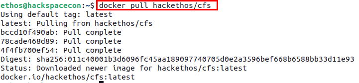{ width="900" }
  <figcaption>Pulling cFS Docker Container</figcaption>
</figure>


```bash
docker run --cap-add CAP_SYS_RESOURCE --net=openc3-cosmos-network --name cfs -p1234:1234/udp -p1235:1235 --rm hackethos/cfs
```
<figure markdown>
{ width="900" }
  <figcaption>Starting cFS Docker Container</figcaption>
</figure>


<figure markdown>
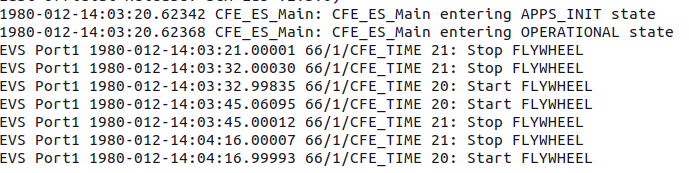{ width="900" }
  <figcaption>cFS Container Running</figcaption>
</figure>


```docker network inspect openc3-cosmos-network```


cFS Container IP
<figure markdown>
{ width="900" }
  <figcaption>cFS Container IP Address</figcaption>
</figure>


Operator Container IP
<figure markdown>
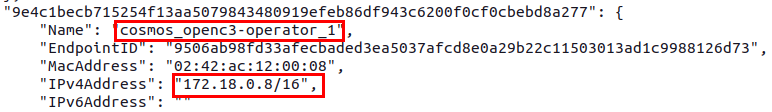{ width="900" }
  <figcaption>OpenC3 Operator Container IP Address</figcaption>
</figure>


```
./openc3.sh cli generate plugin CFS
```
<figure markdown>
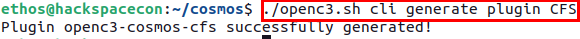{ width="900" }
  <figcaption>Generating cFS Plugin for COSMOS</figcaption>
</figure>


```
cd openc3-cosmos-cfs/
../openc3.sh cli generate target CFS
```
<figure markdown>
{ width="900" }
  <figcaption>Generating cFS Target</figcaption>
</figure>


Now, in your favorite text editor of choice, open the ```plugin.txt``` file and replace the contents with the following:

```bash
VARIABLE ip 127.0.0.1
VARIABLE port_tm 1235
VARIABLE port_tc 1234
VARIABLE cfs_target_name CFS

TARGET CFS <%= cfs_target_name %>
# hostname   write_dest_port   read_port   write_src_port   interface_address   ttl   write_timeout   read_timeout   bind_address
INTERFACE <%= cfs_target_name %>_INT udp_interface.rb <%= ip %> <%= port_tc %> <%= port_tm %> nil nil 128 nil nil
  MAP_TARGET <%= cfs_target_name %>
```


```
cd targets/CFS/cmd_tlm/
rm *
touch cfs_cmds.txt cfs_tlm.txt to_lab_cmds.txt
```
<figure markdown>
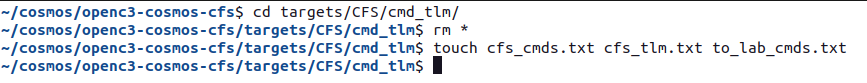{ width="900" }
  <figcaption>Creating Empty Files for Packet Definitions</figcaption>
</figure>


Open the file ```to_lab_cmds.txt``` and insert the following content.

```
COMMAND CFS TO_LAB_ENABLE BIG_ENDIAN "Enable telemetry"
  #                   NAME      BITS TYPE   min VAL     max VAL    init VAL  DESCRIPTION
  APPEND_ID_PARAMETER STREAM_ID  16  UINT   0x1880      0x1880     0x1880    "Stream ID"
    FORMAT_STRING "0x%04X"
  APPEND_PARAMETER    SEQUENCE   16  UINT   0xC000      MAX_UINT16 0xC000    ""
    FORMAT_STRING "0x%04X"
  APPEND_PARAMETER    PKT_LEN    16  UINT   0x0001      0xFFFF     0x0012    "length of the packet"
  APPEND_PARAMETER    CMD_ID      8  UINT   6           6          6         ""
  APPEND_PARAMETER    CHECKSUM    8  UINT   MIN_UINT8   MAX_UINT8  0x98      ""
    FORMAT_STRING "0x%2X"
  APPEND_PARAMETER    DEST_IP   144  STRING "127.0.0.1"                      "Destination IP, i.e. 172.16.9.112, pc-57"
```

Next, open the file ```cfs_cmds.txt``` and insert the following content.

```
COMMAND CFS NOOP BIG_ENDIAN "NOOP Command"
  # cFS primary header
  APPEND_ID_PARAMETER    STREAM_ID   16   UINT   0x1882      0x1882      0x1882      "Packet Identification"
      FORMAT_STRING "0x%04X"
  APPEND_PARAMETER       SEQUENCE    16   UINT   MIN_UINT16  MAX_UINT16  0xC000      ""
      FORMAT_STRING "0x%04X"
  APPEND_PARAMETER       PKT_LEN     16   UINT   0x0001      0x0001      0x0001      "Packet length"
  # cFS CMD secondary header
  APPEND_PARAMETER       CMD_ID       8   UINT   0           0           0           ""
  APPEND_PARAMETER       CHECKSUM     8   UINT   MIN_UINT8   MAX_UINT8   MIN_UINT8   ""

COMMAND CFS RESET BIG_ENDIAN "Reset Counters Command"
  APPEND_ID_PARAMETER    STREAM_ID   16   UINT   0x1882      0x1882      0x1882      "Packet Identification"
      FORMAT_STRING "0x%04X"
  APPEND_PARAMETER       SEQUENCE    16   UINT   MIN_UINT16  MAX_UINT16  0xC000      ""
      FORMAT_STRING "0x%04X"
  APPEND_PARAMETER       PKT_LEN     16   UINT   0x0001      0x0001      0x0001      "Packet length"
  APPEND_PARAMETER       CMD_ID       8   UINT   1           1           1           ""
  APPEND_PARAMETER       CHECKSUM     8   UINT   MIN_UINT8   MAX_UINT8   MIN_UINT8   ""

COMMAND CFS PROCESS BIG_ENDIAN "Process Command"
  APPEND_ID_PARAMETER    STREAM_ID   16   UINT   0x1882      0x1882      0x1882      "Packet Identification"
      FORMAT_STRING "0x%04X"
  APPEND_PARAMETER       SEQUENCE    16   UINT   MIN_UINT16  MAX_UINT16  0xC000      ""
      FORMAT_STRING "0x%04X"
  APPEND_PARAMETER       PKT_LEN     16   UINT   0x0001      0x0001      0x0001      "Packet length"
  APPEND_PARAMETER       CMD_ID       8   UINT   2           2           2           ""
  APPEND_PARAMETER       CHECKSUM     8   UINT   MIN_UINT8   MAX_UINT8   MIN_UINT8   ""
```

Finally, you need to open the file ```cfs_tlm.txt``` and insert the following content

```
TELEMETRY CFS HK BIG_ENDIAN "housekeeping telemetry"
  #                NAME       BITS  TYPE    ID      DESCRIPTION
  APPEND_ID_ITEM   STREAM_ID   16   UINT    0x0883  "Stream ID"
    FORMAT_STRING "0x%04X"
  APPEND_ITEM      SEQUENCE    16   UINT            "Packet Sequence"
    FORMAT_STRING "0x%04X"
  APPEND_ITEM      PKT_LEN     16   UINT            "Length of the packet"
  # telemetry secondary header
  APPEND_ITEM      SECONDS     32   UINT            ""
        UNITS Seconds sec
  APPEND_ITEM      SUBSECS     16   UINT            ""
        UNITS Milliseconds ms
  # some bytes not known for what
  APPEND_ITEM      SPARE2ALIGN 32   UINT            "Spares"
  # payload
  APPEND_ITEM      CMD_ERRS     8   UINT            "Command Error Counter"
  APPEND_ITEM      CMD_CNT      8   UINT            "Command Counter"
  # spare / alignment
  APPEND_ITEM      SPARE       16   UINT            "Spares"
```
<figure markdown>
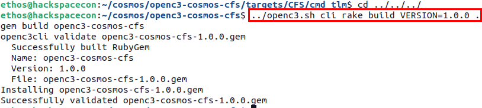{ width="900" }
  <figcaption>Building cFS COSMOS Plugin</figcaption>
</figure>


```wget https://byos.ethoslabs.space/openc3-cosmos-cfs-1.0.0.gem```

Click Here: [Download cFS Plugin](openc3-cosmos-cfs-1.0.0.gem)
<figure markdown>
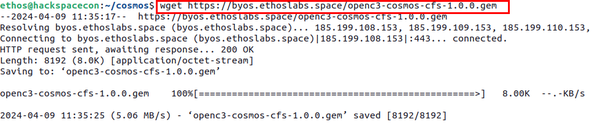{ width="900" }
  <figcaption>Downloading Pre-generated Plugin</figcaption>
</figure>


<figure markdown>
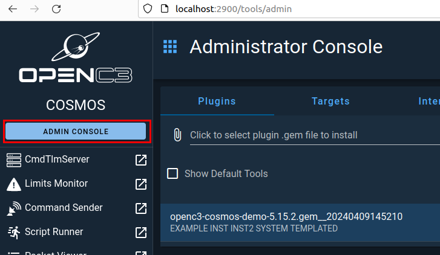{ width="900" }
  <figcaption>Admin Console in COSMOS</figcaption>
</figure>


<figure markdown>
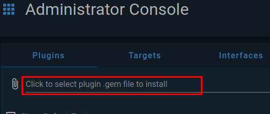{ width="900" }
  <figcaption>Click to Install Plugin</figcaption>
</figure>


<figure markdown>
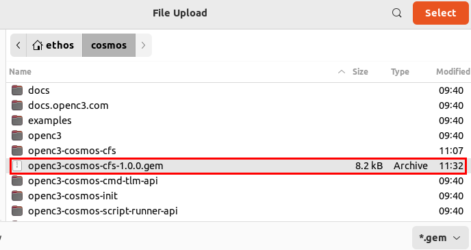{ width="900" }
  <figcaption>Select cFS Plugin Gem file</figcaption>
</figure>


<figure markdown>
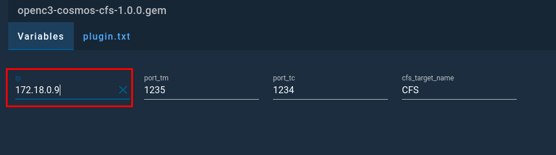{ width="900" }
  <figcaption>Set IP Varible to cFS Container IP</figcaption>
</figure>


<figure markdown>
{ width="900" }
  <figcaption>CFS_INT Connected in COSMOS</figcaption>
</figure>


<figure markdown>
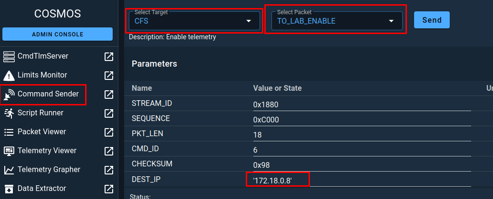{ width="900" }
  <figcaption>Setting DEST_IP Address in TO_LAB_ENABLE Command</figcaption>
</figure>


<figure markdown>
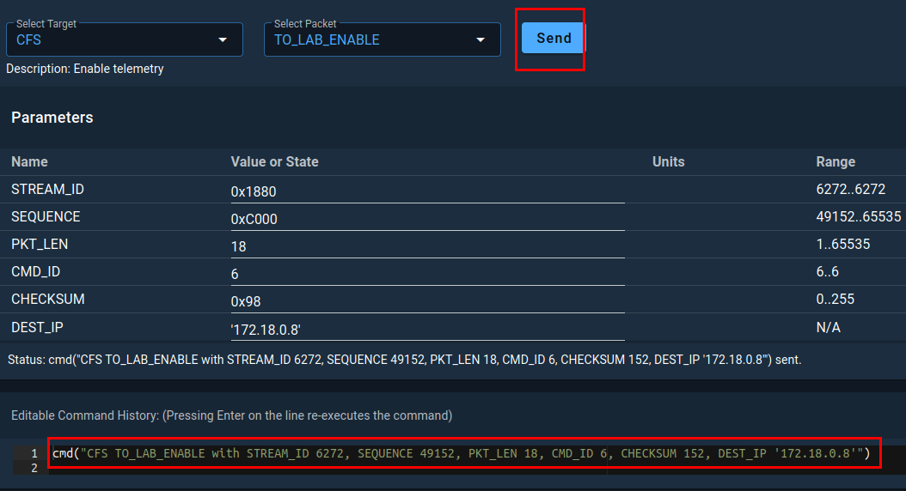{ width="900" }
  <figcaption>Sending Telecommand Packet</figcaption>
</figure>


<figure markdown>
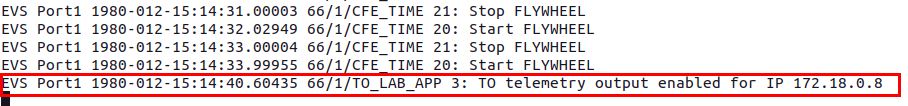{ width="900" }
  <figcaption>cFS Container Showing Telemetry Output Enabled</figcaption>
</figure>


<figure markdown>
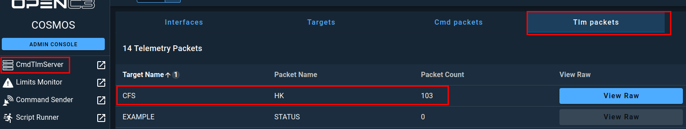{ width="900" }
  <figcaption>COSMOS Recieving TLM Packets from cFS</figcaption>
</figure>

## Removing cFS Plugin

<figure markdown>
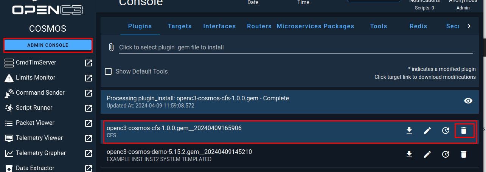{ width="900" }
  <figcaption>Deleting cFS Plugin From Admin Console</figcaption>
</figure>


<figure markdown>
{ width="900" }
  <figcaption>Click Delete</figcaption>
</figure>


```CRTL + c ```

<figure markdown>
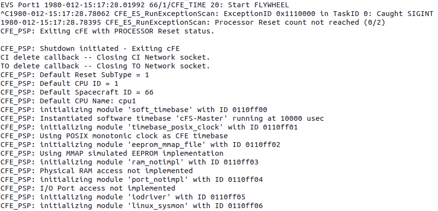{ width="900" }
  <figcaption>CTRL + c Terminating cFS Container</figcaption>
</figure>

