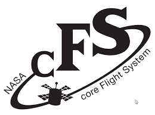
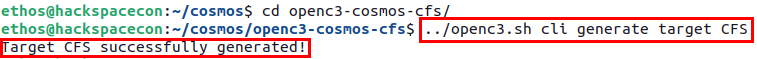
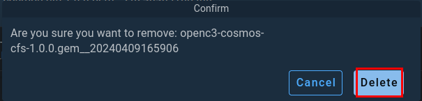

---
hide:
  - toc
---

# NASA's Core Flight System (cFS)

<figure markdown>

</figure>


NASA's Core Flight System (cFS) is a platform for spacecraft flight software development. It's designed to be a highly reusable, scalable, and configurable system that can support various spaceflight missions, including satellites, spacecraft, and other space-related applications. The cFS consists of a core set of reusable software components known as the Core Flight Executive (cFE), which provides the infrastructure for building flight software applications. These applications can perform various functions such as data collection, spacecraft control, and communication.

One of the key features of the cFS is its modular architecture, which allows developers to add or modify components according to the specific needs of their mission without altering the core system. This modularity and configurability make the cFS a cost-effective and efficient solution for spaceflight software development.

The cFS is released under the NASA Open Source Agreement (NOSA), making it freely available for anyone to use, modify, and distribute. This openness has facilitated a growing community of users and contributors from NASA, other government agencies, industry, and academia, who collaborate to improve and expand the system's capabilities.

By providing a robust, flexible foundation for flight software development, the cFS supports NASA's missions and objectives in exploring space, advancing our understanding of the universe, and developing the technologies needed for future space exploration.

## Deploying NASA's cFS
The first satellite you will be deploying will be a instance of cFS running in a Docker container. This is not a fully functional or operational but is a great example of what is possible using and open-source, flight proven software, in a virtual environment. 

To get started, you need to pull the cFS Docker container from the Docker Hub, using the following command:

```
docker pull hackethos/cfs
```
<figure markdown>

  <figcaption>Pulling cFS Docker Container</figcaption>
</figure>

Once the container image has been downloaded successfully, you can launch the container using the following command:

```bash
docker run --cap-add CAP_SYS_RESOURCE --net=openc3-cosmos-network --name cfs -p1234:1234/udp -p1235:1235 --rm hackethos/cfs
```

<figure markdown>

  <figcaption>Starting cFS Docker Container</figcaption>
</figure>

After running the previous command, you should see out from the container that looks like what is shown below.

<figure markdown>

  <figcaption>cFS Container Running</figcaption>
</figure>

Now that your cFS container is running, you need to generate a plugin for COSMOS that will allow COSMOS to be able to talk to cFS and vice-versus. 

If you want to see the entire process, expand the ```Long Version``` section below but for the purpose of this workshop, you can skip that section.

??? Long-Version

    To generate a plugin for cFS to work with COSMOS you need to start with the following command from the ```cosmos``` directory.

    ```
    ./openc3.sh cli generate plugin CFS
    ```
    <figure markdown>
    
    <figcaption>Generating cFS Plugin for COSMOS</figcaption>
    </figure>

    Next, you need to ```cd``` into the newly created plugin directory to generate a target with the following commands:

    ```
    cd openc3-cosmos-cfs/
    ../openc3.sh cli generate target CFS
    ```
    <figure markdown>
    
    <figcaption>Generating cFS Target</figcaption>
    </figure>


    Now, in your favorite text editor of choice, open the ```plugin.txt``` file and **replace** the contents with the following:

    ```bash
    VARIABLE ip 127.0.0.1
    VARIABLE port_tm 1235
    VARIABLE port_tc 1234
    VARIABLE cfs_target_name CFS

    TARGET CFS <%= cfs_target_name %>
    # hostname   write_dest_port   read_port   write_src_port   interface_address   ttl   write_timeout   read_timeout   bind_address
    INTERFACE <%= cfs_target_name %>_INT udp_interface.rb <%= ip %> <%= port_tc %> <%= port_tm %> nil nil 128 nil nil
    MAP_TARGET <%= cfs_target_name %>
    ```
    Save that file and then navigate to the ```targets/CFS/cmd_tlm``` directory and issue the following commands:

    ```
    cd targets/CFS/cmd_tlm/
    rm *
    touch cfs_cmds.txt cfs_tlm.txt to_lab_cmds.txt
    ```
    <figure markdown>
    
    <figcaption>Creating Empty Files for Packet Definitions</figcaption>
    </figure>

    Now you will create your first packet definition by opening the file ```to_lab_cmds.txt``` and insert the following content.

    ```
    COMMAND CFS TO_LAB_ENABLE BIG_ENDIAN "Enable telemetry"
    #                   NAME      BITS TYPE   min VAL     max VAL    init VAL  DESCRIPTION
    APPEND_ID_PARAMETER STREAM_ID  16  UINT   0x1880      0x1880     0x1880    "Stream ID"
        FORMAT_STRING "0x%04X"
    APPEND_PARAMETER    SEQUENCE   16  UINT   0xC000      MAX_UINT16 0xC000    ""
        FORMAT_STRING "0x%04X"
    APPEND_PARAMETER    PKT_LEN    16  UINT   0x0001      0xFFFF     0x0012    "length of the packet"
    APPEND_PARAMETER    CMD_ID      8  UINT   6           6          6         ""
    APPEND_PARAMETER    CHECKSUM    8  UINT   MIN_UINT8   MAX_UINT8  0x98      ""
        FORMAT_STRING "0x%2X"
    APPEND_PARAMETER    DEST_IP   144  STRING "127.0.0.1"                      "Destination IP, i.e. 172.16.9.112, pc-57"
    ```

    Next, open the file ```cfs_cmds.txt``` and insert the following content.

    ```
    COMMAND CFS NOOP BIG_ENDIAN "NOOP Command"
    # cFS primary header
    APPEND_ID_PARAMETER    STREAM_ID   16   UINT   0x1882      0x1882      0x1882      "Packet Identification"
        FORMAT_STRING "0x%04X"
    APPEND_PARAMETER       SEQUENCE    16   UINT   MIN_UINT16  MAX_UINT16  0xC000      ""
        FORMAT_STRING "0x%04X"
    APPEND_PARAMETER       PKT_LEN     16   UINT   0x0001      0x0001      0x0001      "Packet length"
    # cFS CMD secondary header
    APPEND_PARAMETER       CMD_ID       8   UINT   0           0           0           ""
    APPEND_PARAMETER       CHECKSUM     8   UINT   MIN_UINT8   MAX_UINT8   MIN_UINT8   ""

    COMMAND CFS RESET BIG_ENDIAN "Reset Counters Command"
    APPEND_ID_PARAMETER    STREAM_ID   16   UINT   0x1882      0x1882      0x1882      "Packet Identification"
        FORMAT_STRING "0x%04X"
    APPEND_PARAMETER       SEQUENCE    16   UINT   MIN_UINT16  MAX_UINT16  0xC000      ""
        FORMAT_STRING "0x%04X"
    APPEND_PARAMETER       PKT_LEN     16   UINT   0x0001      0x0001      0x0001      "Packet length"
    APPEND_PARAMETER       CMD_ID       8   UINT   1           1           1           ""
    APPEND_PARAMETER       CHECKSUM     8   UINT   MIN_UINT8   MAX_UINT8   MIN_UINT8   ""

    COMMAND CFS PROCESS BIG_ENDIAN "Process Command"
    APPEND_ID_PARAMETER    STREAM_ID   16   UINT   0x1882      0x1882      0x1882      "Packet Identification"
        FORMAT_STRING "0x%04X"
    APPEND_PARAMETER       SEQUENCE    16   UINT   MIN_UINT16  MAX_UINT16  0xC000      ""
        FORMAT_STRING "0x%04X"
    APPEND_PARAMETER       PKT_LEN     16   UINT   0x0001      0x0001      0x0001      "Packet length"
    APPEND_PARAMETER       CMD_ID       8   UINT   2           2           2           ""
    APPEND_PARAMETER       CHECKSUM     8   UINT   MIN_UINT8   MAX_UINT8   MIN_UINT8   ""
    ```

    Finally, you need to open the file ```cfs_tlm.txt``` and insert the following content

    ```
    TELEMETRY CFS HK BIG_ENDIAN "housekeeping telemetry"
    #                NAME       BITS  TYPE    ID      DESCRIPTION
    APPEND_ID_ITEM   STREAM_ID   16   UINT    0x0883  "Stream ID"
        FORMAT_STRING "0x%04X"
    APPEND_ITEM      SEQUENCE    16   UINT            "Packet Sequence"
        FORMAT_STRING "0x%04X"
    APPEND_ITEM      PKT_LEN     16   UINT            "Length of the packet"
    # telemetry secondary header
    APPEND_ITEM      SECONDS     32   UINT            ""
            UNITS Seconds sec
    APPEND_ITEM      SUBSECS     16   UINT            ""
            UNITS Milliseconds ms
    # some bytes not known for what
    APPEND_ITEM      SPARE2ALIGN 32   UINT            "Spares"
    # payload
    APPEND_ITEM      CMD_ERRS     8   UINT            "Command Error Counter"
    APPEND_ITEM      CMD_CNT      8   UINT            "Command Counter"
    # spare / alignment
    APPEND_ITEM      SPARE       16   UINT            "Spares"
    ```

    Lastly, you need to navigate to the root directory of your plugin and build the plugin using the following command:

    ```cd ../../../``` and ```../openc3.sh cli rake build VERSION=1.0.0 .```

    <figure markdown>
    
    <figcaption>Building cFS COSMOS Plugin</figcaption>
    </figure>


If you skipped the ```Long Version``` you will need to download the pre-generated cFS plugin for COSMOS using the following command or downloading it from the lik that follows. If you use the link, download it from your browser in your VM.

```wget https://byos.ethoslabs.space/openc3-cosmos-cfs-1.0.0.gem```

Click Here: [Download cFS Plugin](openc3-cosmos-cfs-1.0.0.gem)
<figure markdown>

  <figcaption>Downloading Pre-generated Plugin</figcaption>
</figure>

The next step in the process is to grab the IP addresses of both your ```cFS``` container as well as the ```openc3-operator``` container. You can do this by running the following command and searching the output.

```docker network inspect openc3-cosmos-network```

Below is an example of cFS Container IP you may see.
<figure markdown>

  <figcaption>cFS Container IP Address</figcaption>
</figure>

Below is an example of the Operator Container IP you may see
<figure markdown>

  <figcaption>OpenC3 Operator Container IP Address</figcaption>
</figure>

!!! Note
    Your IP addresses may not be in the 172.18.x.x range. That is okay.

Now you will need to go back to COSMOS in your VM and click on the ```Admin Console``` section in the left side menu.

<figure markdown>
{ width="900" }
  <figcaption>Admin Console in COSMOS</figcaption>
</figure>

Then in the middle section, click on the area where is says ```Click to select plugin...```

<figure markdown>
{ width="900" }
  <figcaption>Click to Install Plugin</figcaption>
</figure>

A file selection popup will appear and you will need to navigate to where you cFS plugin is located and select it.

<figure markdown>
{ width="900" }
  <figcaption>Select cFS Plugin Gem file</figcaption>
</figure>

After you select your plugin file, you will get prompted to configure the plugin. Here you will need to supply the IP address of your ```cFS``` container as shown below.

<figure markdown>
{ width="900" }
  <figcaption>Set IP Varible to cFS Container IP</figcaption>
</figure>

After entering the IP address, you can click ```Install```. It will take a few moments for the plugin to be processed but you should see a message that states the process was completed.

Once completed, you can navigate to the ```CmdTlmServer``` section of COSMOS where you will see the ```CFS_INT``` interface as been configured and connected.

<figure markdown>
{ width="900" }
  <figcaption>CFS_INT Connected in COSMOS</figcaption>
</figure>

Next, you need to navigate to the ```Command Sender``` section from the left menu. ONce there, make sure that CFS is selected as the target and then select the ```TO_LAB_ENABLE``` Packet. With that packet selected, you will see a field called ```DEST_IP``` that you will need to populate with the ```openc3-operator``` container IP address, **making sure to preserve the single quotes.**

<figure markdown>
{ width="900" }
  <figcaption>Setting DEST_IP Address in TO_LAB_ENABLE Command</figcaption>
</figure>

Now you are ready to click ```SEND```. In doing so, you should see an output like the one below.

<figure markdown>
{ width="900" }
  <figcaption>Sending Telecommand Packet</figcaption>
</figure>

Now, switch over to your terminal running cFS and you should see that the command was successfully received.

<figure markdown>
{ width="900" }
  <figcaption>cFS Container Showing Telemetry Output Enabled</figcaption>
</figure>

Now, back in COSMOS, if you navigate to the ```CmdTlmServer``` you should see that the ```CFS_INT``` interface is receiving TLM Packets.

<figure markdown>
{ width="900" }
  <figcaption>COSMOS Receiving TLM Packets from cFS</figcaption>
</figure>

As stated previously, this implementation of cFS is not feature complete but does demonstrate the fundamental concepts of telecommands and telemetry in a space system.

---

## Removing cFS Plugin

For the next section of this workshop, you will use the same port binding that your cFS container is currently using, so you need to do a little clean up to get ready. 

First, you will navigate to the ```Admin Console``` section of COSMOS and find the cFS plugin and click on the trash can icon.

<figure markdown>
{ width="900" }
  <figcaption>Deleting cFS Plugin From Admin Console</figcaption>
</figure>

When prompted, click on ```Delete``` to remove the plugin from COSMOS.

<figure markdown>
{ width="900" }
  <figcaption>Click Delete</figcaption>
</figure>

Next, you need to switch over to your terminal running cFS and stop it using ```CRTL + c ```

<figure markdown>
{ width="900" }
  <figcaption>CTRL + c Terminating cFS Container</figcaption>
</figure>

Once cFS stops, the container will be removed but can redeployed at anytime.

