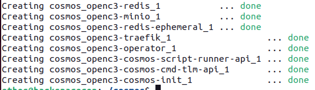
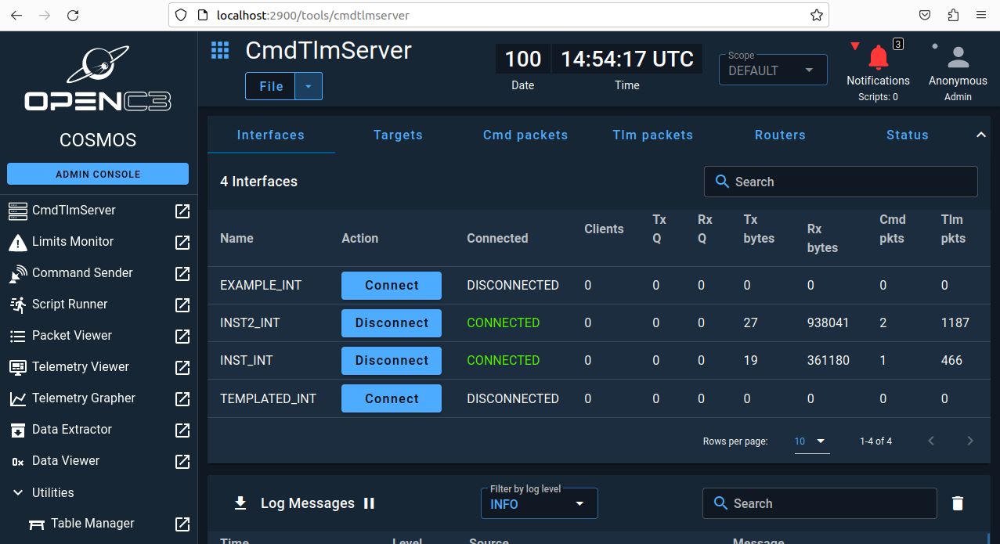

---
hide:
  - toc
---


OpenC3's COSMOS is a command-and-control system designed for small satellite missions. It is an evolution of the COSMOS software initially developed by Ball Aerospace, which has been widely used in the space industry for satellite command and control. COSMOS provides a comprehensive suite of tools for mission planning, telemetry and command processing, data analysis, and system simulation, making it a versatile solution for managing space missions.

The transition to OpenC3 represents a shift towards a more open and collaborative approach to space mission control software. OpenC3 aims to foster a community where users and developers can contribute to the development and improvement of COSMOS, ensuring it remains a state-of-the-art tool for mission control. This open-source philosophy allows for greater innovation, adaptability, and cost efficiency, as users can customize the software to meet their specific mission requirements without the constraints of proprietary software licenses.

COSMOS under OpenC3 includes features such as:

1. **Real-time telemetry processing:** It can process and display telemetry data in real time, allowing mission operators to monitor the status and health of their spacecraft.
2. **Command and control capabilities:** Operators can send commands to their spacecraft, automate command sequences, and ensure the safety and success of their missions.
3. **Data analysis and visualization:** COSMOS provides tools for analyzing telemetry data, generating reports, and visualizing data trends, which are crucial for mission analysis and decision-making.
4. **System simulation:** It can simulate spacecraft behavior and mission scenarios, helping teams test and validate their operations before execution.

By providing these capabilities within an open-source framework, OpenC3's COSMOS enables a wide range of entities, from small startups to educational institutions and research organizations, to access sophisticated mission control software that was once the domain of large aerospace corporations and government agencies. This democratization of space technology contributes to the growing accessibility of space exploration and utilization.

---
## Deploying OpenC3 COSMOS

OpenC3 COMSOS is going to be the command-and-control system that will be utilized to simulate the Ground Segment in your BYOS virtual environment. 


To get started, you must clone the GitHub repository using the following command:
```
git clone https://github.com/OpenC3/cosmos.git
```

<figure markdown>

  <figcaption>Cloning OpenC3 COMSOS Repository</figcaption>
</figure>

Once you have cloned the repo, you can navigate into the repo using the following command: ```cd cosmos```.

Before deploying COMSOS, you first need to make a modification to the ```compose.yaml``` file to allow COSMOS to be able to communicate with the virtual satellites you will be deploying shortly. To make the edits, use the text editor of your choice and edit the ```compose.yaml``` file. One such method is using ```nano```.

```
nano compose.yaml
```
On line 161, you will find a line that contains ```# ports:``` in the ```openc3-operator``` section, as shown below.
```yaml
  openc3-operator:
    user: "${OPENC3_USER_ID:-1001}:${OPENC3_GROUP_ID:-1001}"
    image: "${OPENC3_REGISTRY}/${OPENC3_NAMESPACE}/openc3-operator${OPENC3_IMAGE_SUFFIX}:${OPENC3_TAG}"
    restart: "unless-stopped"
    # ports:
    #  - "127.0.0.1:7779:7779" # Open port for the demo router
    depends_on:
```

<figure markdown>

  <figcaption>COSMOS compose.yaml Default</figcaption>
</figure>

You will need to modify the ```ports``` section to look like the snippet below, where ```ports:``` is uncommented and the value ```- "235:1235/udp"``` below that.

```yaml
  openc3-operator:
    user: "${OPENC3_USER_ID:-1001}:${OPENC3_GROUP_ID:-1001}"
    image: "${OPENC3_REGISTRY}/${OPENC3_NAMESPACE}/openc3-operator${OPENC3_IMAGE_SUFFIX}:${OPENC3_TAG}"
    restart: "unless-stopped"
    ports:
    - "1235:1235/udp"
    #  - "127.0.0.1:7779:7779" # Open port for the demo router
    depends_on:
```

<figure markdown>

  <figcaption>Modified Ports Section in openc3-operator Container Config</figcaption>
</figure>

If using ```nano```, once you have made the changes, you can save the file with the following key sequence.

```CRTL + x```, then ```y``` to save.

Having modified the ```compose.yaml``` file, you are now ready to deploy COSMOS.

To deploy COSMOS, you need to run the openc3.sh shell script using the following command:

```
./openc3.sh run
```
<figure markdown>

  <figcaption>Running OpenC3 COSMOS</figcaption>
</figure>

It will take some time for the process to run if it is the first time you are running the command, as it will need to download the necessary Docker containers.

Once completed you should see output like what is shown below.

!!! Note
    If you get a permission error, try running the previous command with ```sudo```.

<figure markdown>

  <figcaption>Startup Complete</figcaption>
</figure>

You can also confirm that COSMOS is running using the ```docekr ps``` command, which will show all the running containers.

<figure markdown>

  <figcaption>Docker PS Output Showing Containers Running</figcaption>
</figure>


Next in a browser in your **VM**, navigate to ```http://localhost:2900``` and you will be prompted to set a password. Feel free to choose any password you would like. Just make sure to remember it.

<figure markdown>
{ width="900" }
  <figcaption>CSOMOS Web Interface</figcaption>
</figure>


After you are logged in, you will see a screen that looks like the following:

<figure markdown>
{ width="900" }
  <figcaption>Logged Into COSMOS</figcaption>
</figure>

## Getting the lay of the land
Now that you have logged into COSMOS, it is time to get familiar with it and what it can do.

On the left side of the screen, you will find the primary navigation menu as shown below:

<figure markdown="span">
  { width="300" }
  <figcaption>COSMOS Sidebar Navigation</figcaption>
</figure>

In the main section of your window you will the ```CmdTlmServer``` interface that has a row of options called ```Interfaces```,```Targets```,```Cmd packets```,```Tlm packets```,```Routers```, and ``` Status```.

<figure markdown="span">
  { width="1100" }
  <figcaption>COSMOS CmdTlmServer Interface</figcaption>
</figure>

The current deployment of COSMOS includes a demonstration plugin that has four interfaces, two of which will have a status of ```Connected```.

<figure markdown="span">
  { width="1100" }
  <figcaption>Connected Interfaces with Cmd and Tlm Packets</figcaption>
</figure>

If you see that the packet counts for both ```Cmd pkts``` and ```Tlm pkts``` increasing, everything is working as expected and data is coming in and from your COSMOS instance. YOu can also look below the ```CmdTlmServer``` window to the ```Log Messages``` console as shown below to see that data is flowing.

<figure markdown="span">
  { width="1100" }
  <figcaption>COSMOS Log Message Console</figcaption>
</figure>

!!! Note
    Due to time restrictions, the instructor will walk you through the rest of this section.


