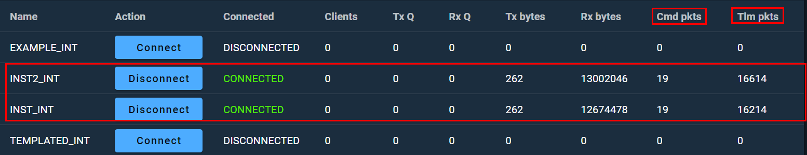

---
hide:
  - toc
---


OpenC3's COSMOS is a command and control system designed for small satellite missions. It is an evolution of the COSMOS software initially developed by Ball Aerospace, which has been widely used in the space industry for satellite command and control. COSMOS provides a comprehensive suite of tools for mission planning, telemetry and command processing, data analysis, and system simulation, making it a versatile solution for managing space missions.

The transition to OpenC3 represents a shift towards a more open and collaborative approach to space mission control software. OpenC3 aims to foster a community where users and developers can contribute to the development and improvement of COSMOS, ensuring it remains a state-of-the-art tool for mission control. This open-source philosophy allows for greater innovation, adaptability, and cost efficiency, as users can customize the software to meet their specific mission requirements without the constraints of proprietary software licenses.

COSMOS under OpenC3 includes features such as:

1. **Real-time telemetry processing:** It can process and display telemetry data in real time, allowing mission operators to monitor the status and health of their spacecraft.
2. **Command and control capabilities:** Operators can send commands to their spacecraft, automate command sequences, and ensure the safety and success of their missions.
3. **Data analysis and visualization:** COSMOS provides tools for analyzing telemetry data, generating reports, and visualizing data trends, which are crucial for mission analysis and decision-making.
4. **System simulation:** It can simulate spacecraft behavior and mission scenarios, helping teams test and validate their operations before execution.

By providing these capabilities within an open-source framework, OpenC3's COSMOS enables a wide range of entities, from small startups to educational institutions and research organizations, to access sophisticated mission control software that was once the domain of large aerospace corporations and government agencies. This democratization of space technology contributes to the growing accessibility of space exploration and utilization.


## Deploying OpenC3 COSMOS


```
git clone https://github.com/OpenC3/cosmos.git
```

<figure markdown>

  <figcaption>Cloning OpenC3 COMSOS Repository</figcaption>
</figure>

```
cd cosmos
```


```
nano compose.yaml
```

Line 161
```yaml
  openc3-operator:
    user: "${OPENC3_USER_ID:-1001}:${OPENC3_GROUP_ID:-1001}"
    image: "${OPENC3_REGISTRY}/${OPENC3_NAMESPACE}/openc3-operator${OPENC3_IMAGE_SUFFIX}:${OPENC3_TAG}"
    restart: "unless-stopped"
    # ports:
    #  - "127.0.0.1:7779:7779" # Open port for the demo router
    depends_on:
```

<figure markdown>

  <figcaption>COSMOS compose.yaml Default</figcaption>
</figure>


```yaml
  openc3-operator:
    user: "${OPENC3_USER_ID:-1001}:${OPENC3_GROUP_ID:-1001}"
    image: "${OPENC3_REGISTRY}/${OPENC3_NAMESPACE}/openc3-operator${OPENC3_IMAGE_SUFFIX}:${OPENC3_TAG}"
    restart: "unless-stopped"
    ports:
    - "1235:1235/udp"
    #  - "127.0.0.1:7779:7779" # Open port for the demo router
    depends_on:
```

<figure markdown>

  <figcaption>Modified Ports Section in openc3-operator Container Config</figcaption>
</figure>


```CRTL + x```, then ```y``` to save.


```
./openc3.sh run
```
<figure markdown>

  <figcaption>Running OpenC3 COSMOS</figcaption>
</figure>


<figure markdown>

  <figcaption>Startup Complete</figcaption>
</figure>


```docekr ps```

<figure markdown>

  <figcaption>Docker PS Output Showing Containers Running</figcaption>
</figure>

In a browser in your VM, navigate to ```http://localhost:2900``` and you will be prompted to set a password. Feel free to chose any password you would like. Just make sure to remember it.

<figure markdown>
{ width="900" }
  <figcaption>CSOMOS Web Interface</figcaption>
</figure>


After getting logged in...

<figure markdown>
{ width="900" }
  <figcaption>Logged Into COSMOS</figcaption>
</figure>

## Getting the lay of the land
Now that you have logged into COSMOS, it is time to get familiar with it and what it is capable of doing.

On the left side of the screen, you will find the primary navigation menu as shown below:

<figure markdown="span">
  { width="300" }
  <figcaption>COSMOS Sidebar Navigation</figcaption>
</figure>

In the main section of your window you will the ```CmdTlmServer``` interface that has a row of options called ```Interfaces```,```Tagrets```,```Cmd packets```,```Tlm packets```,```Routers```, and ``` Status```.

<figure markdown="span">
  { width="1100" }
  <figcaption>COSMOS CmdTlmServer Interface</figcaption>
</figure>

The current deployment of COSMOS includes a demonstration plugin that has four interfaces, two of which will have a status of ```Connected```.

<figure markdown="span">
  { width="1100" }
  <figcaption>Connected Interfaces with Cmd and Tlm Packets</figcaption>
</figure>

If you see that the packet counts for both ```Cmd pkts``` and ```Tlm pkts``` increasing, everyhing is working as expected and data is coming in and from your COSMOS instance. YOu can also look below the ```CmdTlmServer``` window to the ```Log Messages``` console as shown below to see that data is flowing.

<figure markdown="span">
  { width="1100" }
  <figcaption>COSMOS Log Messge Console</figcaption>
</figure>


