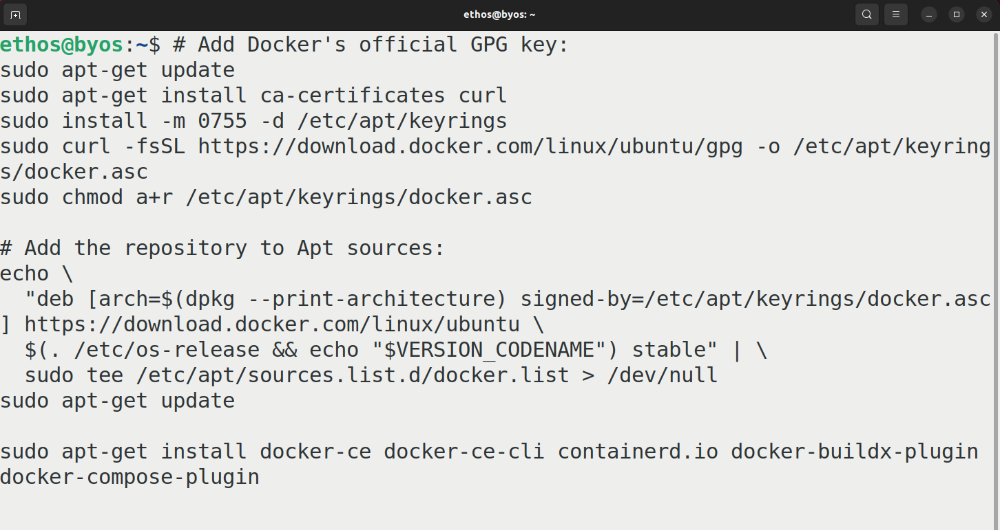
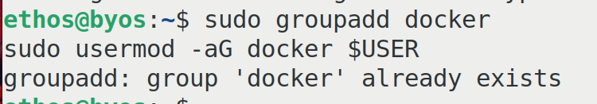
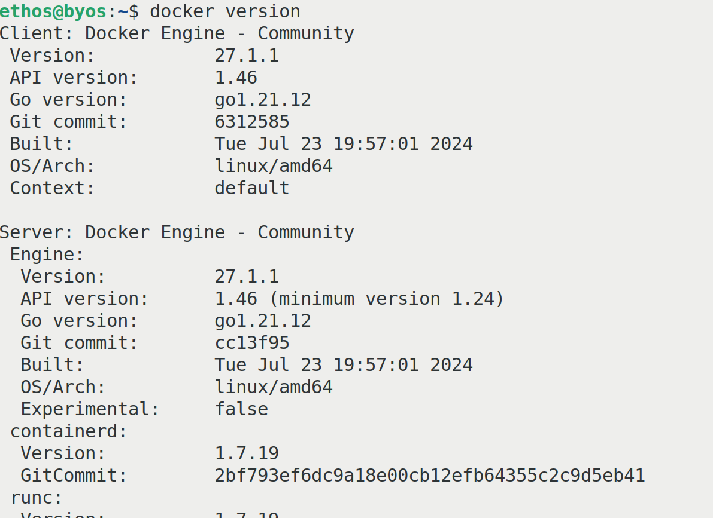

{width="900"}

# B.Y.O.S. - Bring Your Own Satellite

In this training class, attendees are introduced to the basics of satellite communication in a **hands-on** manner. Also, through the power of virtualization and open-source software, attendees will get a step-by-step guide to creating their own personal satellite lab, while helping discover the fundamental principles of satellite communication, from orbital mechanics to data transmission protocols, as you design, simulate, and experiment with satellite systems in a risk-free, virtual environment.

Unveil the secrets of satellite technology, gain hands-on experience with real-world scenarios such as configuring and controlling your virtual satellite. This unique learning experience equips you with the knowledge and practical skills needed to explore the possibilities of satellite communication. Unlock the universe of opportunities that satellite communication offers, right from your laptop.

## Requirements
Virtual Machine Running Ubuntu 22.04 LTS or later with 4 Cores and at least 4GB of RAM. It is recommended you have a disk size of 30 GB.

Both **AMD64** and **ARM64** versions are supported by this documentation. 

!!! Note
    32-Bit (x86) Virtual Machines are **NOT** supported!

## Setting up your Virtual Machine
Before you get started, you need to get your virtual machine set up. First you will want to update and install some packages within Ubuntu using the following commands:

```
# Add Docker's official GPG key:
sudo apt-get update
sudo apt-get install ca-certificates curl -y
sudo install -m 0755 -d /etc/apt/keyrings
sudo curl -fsSL https://download.docker.com/linux/ubuntu/gpg -o /etc/apt/keyrings/docker.asc
sudo chmod a+r /etc/apt/keyrings/docker.asc

# Add the repository to Apt sources:
echo \
  "deb [arch=$(dpkg --print-architecture) signed-by=/etc/apt/keyrings/docker.asc] https://download.docker.com/linux/ubuntu \
  $(. /etc/os-release && echo "$VERSION_CODENAME") stable" | \
  sudo tee /etc/apt/sources.list.d/docker.list > /dev/null
sudo apt-get update

sudo apt-get install docker-ce docker-ce-cli containerd.io docker-buildx-plugin docker-compose-plugin -y
```



Once **Docker** and its components are installed, you will want to add your user account to the **docker** group using the following commands:

```
sudo groupadd docker
sudo usermod -aG docker $USER
```
{width:300px}

!!!
    You may get a message that the group **docker** already exists - if so, just ignore it

Lastly, you have to make sure the rights of the **docker** group are accessible to your user, you should log off of your VM and then log back in.   

Once logged back into your VM, you can open a terminal, **CTRL + ALT + T** works well to do that, and then run the following command to make sure you can run **Docker** with no issues: 

```
docker version
```



If your output looks like the above, you are ready to go.

!!! Note
    If you get a permissions error, you will need to run **all** Docker-related commands with **sudo** prepended such as **sudo docker version** as well as OpenC3 commands.

You will also need to make one additional change to your system to complete the rest of the workshop. Since this workshop is completely offline, you will need to configure your Docker daemon to allow for use of the the local docker registry hosting used in this workshop.

Do do this, you need to create or edit the Docker daemon file located at ```/etc/docker/daemon.json```


```
{
  "insecure-registries": ["registry.ethos.labs:443"]
}
```


```
sudo systemctl restart docker.service 
```


