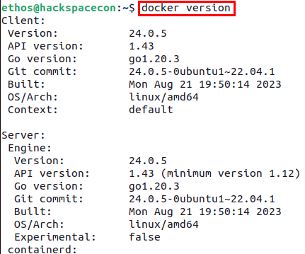

---
hide:
  - toc
---

<figure markdown>
{ width="900" }
</figure>

<h1 style="text-align: center;"> B.Y.O.S. - Bring Your Own Satellite</h1>

In this training class, attendees are introduced to the basics of satellite communication in a hands-on manner. Also, through the power of virtualization and open-source software, attendees will get a step-by-step guide to create their own personal satellite lab, while helping discover the fundamental principles of satellite communication, from orbital mechanics to data transmission protocols, as you design, simulate, and experiment with satellite systems in a risk-free, virtual environment.

Unveil the secrets of satellite technology, gain hands-on experience with real-world scenarios, and configuring and controlling your virtual satellite. This unique learning experience equips you with the knowledge and practical skills needed to explore the possibilities of satellite communication. Unlock the universe of opportunities that satellite communication offers, right from your own laptop.

---
## Requirements
Virtual Machine Running Ubuntu 22.04 LTS or later with 4 Cores and at least 4GB of Ram. It is recommended you have a disk size of 30 GB.

Both ```AMD64``` and ```ARM64``` versions are supported by this documentation. 

!!! Note
    32-Bit (x86) Virtual Machines are **NOT** supported!

## Setting up your Virtual Machine
Before you get started, you need to get your virtual machine set up. First you will want to update and upgrade Ubuntu using the following commands:
```
sudo apt update && sudo apt dist-upgrade -y
```

<figure markdown>

  <figcaption>Updating OS</figcaption>
</figure>

Depending on how long it has been since you last updated your virtual machine, it may take a few moments. Once it is done, you need to install the only dependency for this workshop, ```Docker``` and all its components. The easiest way to accomplish this is to install ```docker-compose``` using the following command:

```
sudo apt install docker-compose -y
```
<figure markdown>

  <figcaption>Installed Docker and Dependencies</figcaption>
</figure>

Once ```Docker``` and its components are installed, you will want to add your user account to the ```docker``` group using the following commands:

```
sudo groupadd docker
sudo usermod -aG docker $USER
```

!!!
    You may get a message that the group ```docker``` already exists - if so, just ignore it

Lastly to have make sure the rights of the ```docker``` group are accessible to your user, you should log off of your VM and then log back in.   

Once logged back in to your VM, you can open a terminal, ```ctrl + alt + t``` works well to do that, and then run the following command to make sure you are able to run Docker with no issues: ```docker version```

<figure markdown>

  <figcaption>Docker Version Output</figcaption>
</figure>

If you output looks like the above, you are ready to go.

!!! Note
    If you get a permissions error, you will need to run **all** Docker related commands with ```sudo``` prepended such as ```sudo docker version``` as well as OpenC3 commands.
